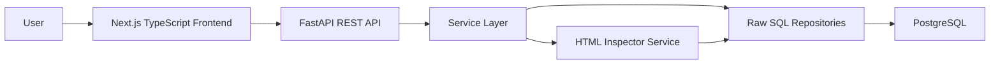
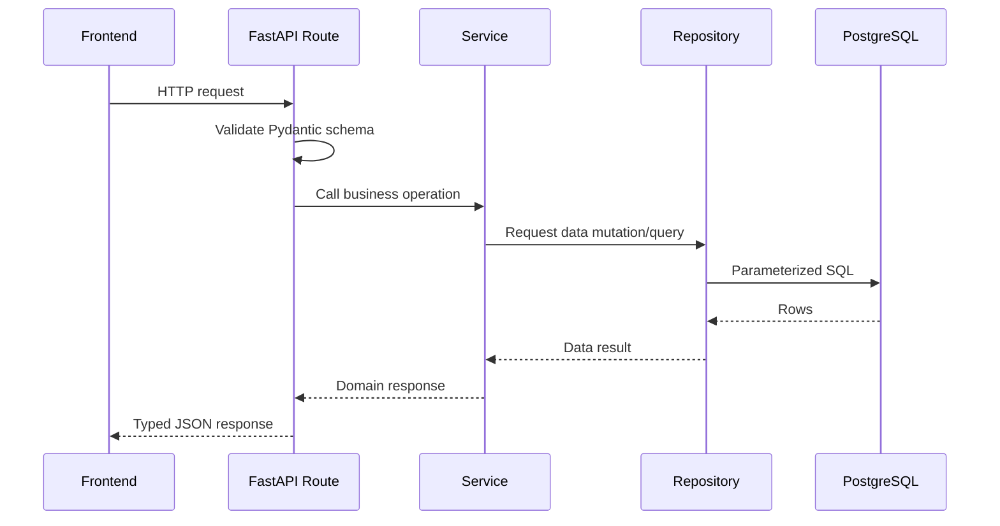

# AutoTest UI Inspector Platform Architecture

## Product Vision

AutoTest UI Inspector Platform is a production-style SaaS dashboard for managing automated UI inspection and test execution workflows. Users can register, create website projects, inspect public page URLs, store extracted UI element metadata, define reusable test cases, run simulated test executions, inspect logs, and review analytics.

The project is designed to demonstrate practical junior software engineering readiness across full-stack application design, REST APIs, raw PostgreSQL, clean backend architecture, component-based frontend development, Docker-friendly setup, validation, testing, and documentation.

## Core Principles

- Use PostgreSQL with raw SQL only.
- Never use an ORM.
- Use parameterized SQL queries for every database operation.
- Keep FastAPI code modular with clear API, service, repository, schema, and database layers.
- Keep frontend UI polished, responsive, and reusable.
- Favor explicit contracts and predictable response shapes.
- Use pagination, filtering, and search on collection endpoints.
- Keep documentation updated as implementation evolves.
- Prefer scalable patterns over quick hacks.

## High-Level System



## Planned Monorepo Structure

```text
autotest-ui-inspector-platform/
  backend/
    app/
      main.py
      api/
        deps.py
        routes/
      core/
        config.py
        security.py
        errors.py
      db/
        connection.py
        transaction.py
      repositories/
      services/
      schemas/
      tests/
    sql/
      schema.sql
      indexes.sql
      seed.sql
    pyproject.toml
    Dockerfile
  frontend/
    app/
    components/
    lib/
    types/
    hooks/
    package.json
    Dockerfile
  docs/
  docker-compose.yml
  README.md
  .env.example
```

## Backend Architecture

The backend will use FastAPI with a layered architecture:

- API routes handle HTTP concerns, dependency injection, request parsing, and response status codes.
- Pydantic schemas define request and response contracts.
- Services enforce business rules, authorization checks, validation that depends on multiple resources, and orchestration.
- Repositories contain raw SQL only and return typed dictionaries or lightweight row objects.
- Database utilities manage connection pools and transactions.
- Core modules provide configuration, JWT handling, password hashing, and shared error types.

## Backend Request Flow



## Backend Modules

### Authentication

- Register user with hashed password.
- Login with email and password.
- Issue JWT access token.
- Expose current authenticated profile.
- Protect all product APIs with bearer token auth.

### Projects

- Create, list, search, update, delete, and view project details.
- Project list includes aggregated page, element, test case, and run counts.
- Project access is scoped to the authenticated owner.

### UI Inspector

- Accept a project ID and page URL.
- Fetch and parse HTML from the URL.
- Extract buttons, inputs, links, and forms.
- Generate selector metadata such as tag, text, name, id, class list, href, input type, and suggested CSS selector.
- Store page metadata and extracted elements.

### Test Cases

- Create test cases attached to projects.
- Store ordered test steps.
- Support filtering by project, status, priority, and search.
- Return test case detail with steps and linked project.

### Test Runs

- Create a run from a test case.
- Simulate step execution for portfolio-friendly local development.
- Store run status, duration, started/finished timestamps, and logs.
- Preserve execution history.

### Logs

- Store step-by-step run logs.
- Include severity, message, step number, failure reason, and timestamp.
- Support searching and filtering by project, test case, run, status, severity, and date range.

### Analytics

- Total projects, test cases, runs, and pass rate.
- Recent run summary.
- Failures by project.
- Common failure reasons.
- At least one CTE-based analytics query.

## Frontend Architecture

The frontend will use Next.js, TypeScript, Tailwind CSS, and reusable dashboard components.

Planned frontend layers:

- `app/` for route segments and page composition.
- `components/ui/` for reusable primitives such as buttons, inputs, cards, modals, badges, tables, tabs, and empty states.
- `components/layout/` for sidebar, top navigation, page shell, and responsive dashboard structure.
- `components/features/` for product-specific widgets.
- `lib/api.ts` for typed API client helpers.
- `lib/auth.ts` for token storage and auth utilities.
- `types/` for shared frontend types.
- `hooks/` for data loading and UI state.

## Authentication Strategy

Phase 3 will implement JWT auth in the backend. Phase 4 will consume it from the frontend.

Planned approach:

- Backend returns `access_token`, `token_type`, and user profile on login.
- Frontend stores access token in a controlled auth utility.
- API client attaches `Authorization: Bearer <token>`.
- Protected dashboard routes redirect unauthenticated users to `/login`.
- Backend always enforces authorization regardless of frontend state.

## Data Access Rules

- Repositories are the only layer allowed to contain SQL.
- SQL must use placeholders and parameter binding.
- No string interpolation for user-supplied SQL values.
- Sorting fields must be allowlisted.
- Pagination uses `limit` and `offset`.
- Deletions should be explicit. Soft delete may be used for user-facing resources if needed, but Phase 2 will start with clear relational constraints.

## Error Handling

Backend responses should use consistent error shapes:

```json
{
  "detail": {
    "code": "PROJECT_NOT_FOUND",
    "message": "Project was not found."
  }
}
```

Planned error categories:

- Validation errors.
- Authentication failures.
- Authorization failures.
- Resource not found.
- Conflict errors such as duplicate email.
- External URL inspection failures.
- Unexpected server errors.

## Testing Strategy

Backend tests will be added in Phase 6:

- Auth registration, login, and current user.
- Project CRUD and authorization boundaries.
- Test case creation and step validation.
- Test run creation and log persistence.
- Analytics response shape and key metrics.

Testing should use isolated test database setup, seeded fixtures, and FastAPI test client requests.

## Security Considerations

- Passwords are hashed with a strong password hashing library.
- JWT secret is environment-based.
- Tokens include expiration.
- All protected resources are scoped by authenticated user ID.
- URL inspection should validate HTTP and HTTPS only.
- Timeouts are required for external page fetching.
- User input is validated through Pydantic and parameterized SQL.

## Deployment and Development

Docker support will be added in Phase 5:

- PostgreSQL service.
- FastAPI backend service.
- Next.js frontend service.
- Environment variable examples.
- Linux-friendly commands.
- Local setup documented in README.

## Phase Roadmap

1. Architecture and planning documentation.
2. PostgreSQL schema, seed data, indexes, and SQL notes.
3. FastAPI backend modules with raw SQL repositories.
4. Next.js frontend consuming real APIs.
5. Docker and docker-compose.
6. Backend tests and README improvements.
7. Refactor, polish, validation, SQL performance, and UI consistency.
