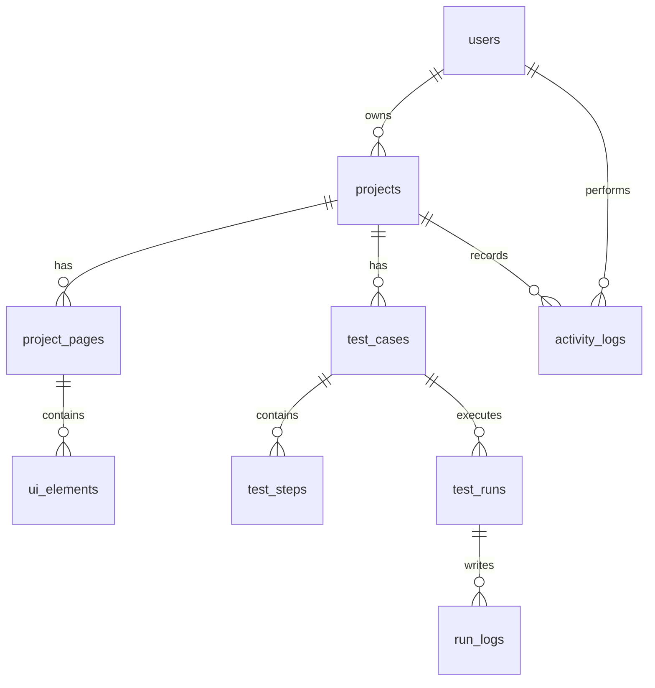

# Database Design

## Database Goals

The database design must demonstrate strong PostgreSQL fundamentals with raw SQL, useful relationships, indexes, joins, aggregations, pagination, filtering, and analytics queries.

The implementation will use:

- PostgreSQL.
- SQL files committed under `backend/sql/`.
- UUID primary keys.
- Foreign keys and useful constraints.
- Parameterized queries only from the application.
- No ORM and no SQL string interpolation with user input.

## Entity Overview

## Tables

### `users`

Stores platform users.

Planned columns:

- `id uuid primary key`
- `name varchar(120) not null`
- `email varchar(255) not null unique`
- `password_hash text not null`
- `role varchar(30) not null default 'user'`
- `created_at timestamptz not null default now()`
- `updated_at timestamptz not null default now()`

Constraints:

- Unique email.
- Role check: `admin`, `user`.

### `projects`

Stores website projects owned by users.

Planned columns:

- `id uuid primary key`
- `owner_id uuid not null references users(id)`
- `name varchar(160) not null`
- `base_url text not null`
- `description text`
- `created_at timestamptz not null default now()`
- `updated_at timestamptz not null default now()`

Constraints:

- Unique project name per owner.
- Base URL validated at application level and optionally with a basic database check for HTTP prefixes.

### `project_pages`

Stores inspected pages.

Planned columns:

- `id uuid primary key`
- `project_id uuid not null references projects(id) on delete cascade`
- `url text not null`
- `title text`
- `status_code integer`
- `html_hash text`
- `inspected_at timestamptz not null default now()`
- `created_at timestamptz not null default now()`

Constraints:

- Unique page URL per project.

### `ui_elements`

Stores extracted UI metadata from inspected pages.

Planned columns:

- `id uuid primary key`
- `project_id uuid not null references projects(id) on delete cascade`
- `page_id uuid not null`
- `element_type varchar(30) not null`
- `tag_name varchar(40) not null`
- `selector text`
- `text_content text`
- `attribute_id text`
- `attribute_name text`
- `attribute_type text`
- `href text`
- `placeholder text`
- `aria_label text`
- `metadata jsonb not null default '{}'::jsonb`
- `created_at timestamptz not null default now()`

Constraints:

- Element type check: `button`, `input`, `link`, `form`.
- `project_id` is duplicated intentionally for faster project-scoped queries and simpler joins.
- Composite foreign key: `(project_id, page_id)` references `project_pages(project_id, id)` so the duplicated project ID cannot drift from the page.

### `test_cases`

Stores reusable test definitions.

Planned columns:

- `id uuid primary key`
- `project_id uuid not null references projects(id) on delete cascade`
- `name varchar(180) not null`
- `description text`
- `priority varchar(20) not null default 'medium'`
- `status varchar(20) not null default 'active'`
- `created_by uuid not null references users(id)`
- `created_at timestamptz not null default now()`
- `updated_at timestamptz not null default now()`

Constraints:

- Priority check: `low`, `medium`, `high`, `critical`.
- Status check: `draft`, `active`, `archived`.
- Unique test case name per project.

### `test_steps`

Stores ordered steps for a test case.

Planned columns:

- `id uuid primary key`
- `test_case_id uuid not null`
- `step_order integer not null`
- `action varchar(40) not null`
- `target text`
- `input_value text`
- `expected_result text not null`
- `created_at timestamptz not null default now()`

Constraints:

- Unique `test_case_id`, `step_order`.
- Action check: `navigate`, `click`, `type`, `assert_text`, `assert_visible`, `wait`.

### `test_runs`

Stores execution history for test cases.

Planned columns:

- `id uuid primary key`
- `project_id uuid not null references projects(id) on delete cascade`
- `test_case_id uuid not null references test_cases(id) on delete cascade`
- `triggered_by uuid not null references users(id)`
- `status varchar(20) not null`
- `environment varchar(80) not null default 'local'`
- `browser varchar(80) not null default 'chromium'`
- `duration_ms integer`
- `failure_reason text`
- `started_at timestamptz not null default now()`
- `finished_at timestamptz`
- `created_at timestamptz not null default now()`

Constraints:

- Status check: `queued`, `running`, `passed`, `failed`, `cancelled`.
- Duration must be non-negative.
- Composite foreign key: `(project_id, test_case_id)` references `test_cases(project_id, id)` so run history remains project-consistent.

### `run_logs`

Stores detailed execution logs.

Planned columns:

- `id uuid primary key`
- `run_id uuid not null references test_runs(id) on delete cascade`
- `test_step_id uuid references test_steps(id) on delete set null`
- `step_order integer`
- `severity varchar(20) not null`
- `status varchar(20) not null`
- `message text not null`
- `failure_reason text`
- `metadata jsonb not null default '{}'::jsonb`
- `created_at timestamptz not null default now()`

Constraints:

- Severity check: `debug`, `info`, `warning`, `error`.
- Status check: `passed`, `failed`, `skipped`.

### `activity_logs`

Stores audit-style product activity.

Planned columns:

- `id uuid primary key`
- `user_id uuid references users(id) on delete set null`
- `project_id uuid references projects(id) on delete cascade`
- `action varchar(80) not null`
- `entity_type varchar(80) not null`
- `entity_id uuid`
- `message text not null`
- `metadata jsonb not null default '{}'::jsonb`
- `created_at timestamptz not null default now()`

## Index Strategy

Planned indexes in `backend/sql/indexes.sql`:

- `users(email)`
- `projects(owner_id, created_at desc)`
- `projects(owner_id, lower(name))`
- `project_pages(project_id, inspected_at desc)`
- `ui_elements(project_id, element_type)`
- `ui_elements(page_id)`
- `test_cases(project_id, status, priority)`
- `test_cases(project_id, created_at desc)`
- `test_steps(test_case_id, step_order)`
- `test_runs(project_id, created_at desc)`
- `test_runs(test_case_id, created_at desc)`
- `test_runs(status, created_at desc)`
- `run_logs(run_id, created_at asc)`
- `run_logs(severity, created_at desc)`
- `activity_logs(user_id, created_at desc)`
- `activity_logs(project_id, created_at desc)`

Search-heavy columns can later use trigram indexes if the project enables `pg_trgm`.

## Important Query Patterns

### Project List With Aggregates

The project list should join or aggregate:

- Page count.
- UI element count.
- Test case count.
- Run count.
- Last run status.

This can be implemented with CTEs or lateral joins.

### Logs Search

Logs should join:

- `run_logs`
- `test_runs`
- `test_cases`
- `projects`

Filters should always include owner scoping through `projects.owner_id = $current_user_id`.

### Analytics CTE

Analytics should include at least one CTE-based query, such as:

- User-owned projects.
- Runs scoped to those projects.
- Aggregate totals.
- Failure grouping.
- Recent run summary.

## Data Integrity Rules

- Project-owned data cascades when a project is deleted.
- Denormalized project IDs on elements and runs are protected by composite foreign keys.
- Run logs cascade when a run is deleted.
- Test steps cascade when a test case is deleted.
- Logs preserve nullable `test_step_id` if a step is removed.
- Application services must verify that a user owns a project before creating dependent records.

## Seed Data Plan

`backend/sql/seed.sql` will include:

- Demo user.
- Several projects.
- Inspected pages.
- UI elements.
- Test cases with steps.
- Test runs with pass and fail results.
- Run logs with realistic messages.
- Activity logs.

Seed data should make the dashboard look useful immediately after local setup.

## Raw SQL Safety Rules

- All repository methods accept explicit parameters.
- Never concatenate user input into SQL.
- Allowlist sort columns and directions.
- Keep dynamic filters built through controlled SQL fragments and parameter arrays.
- Use transactions for multi-step writes such as creating test cases with steps or creating runs with logs.
